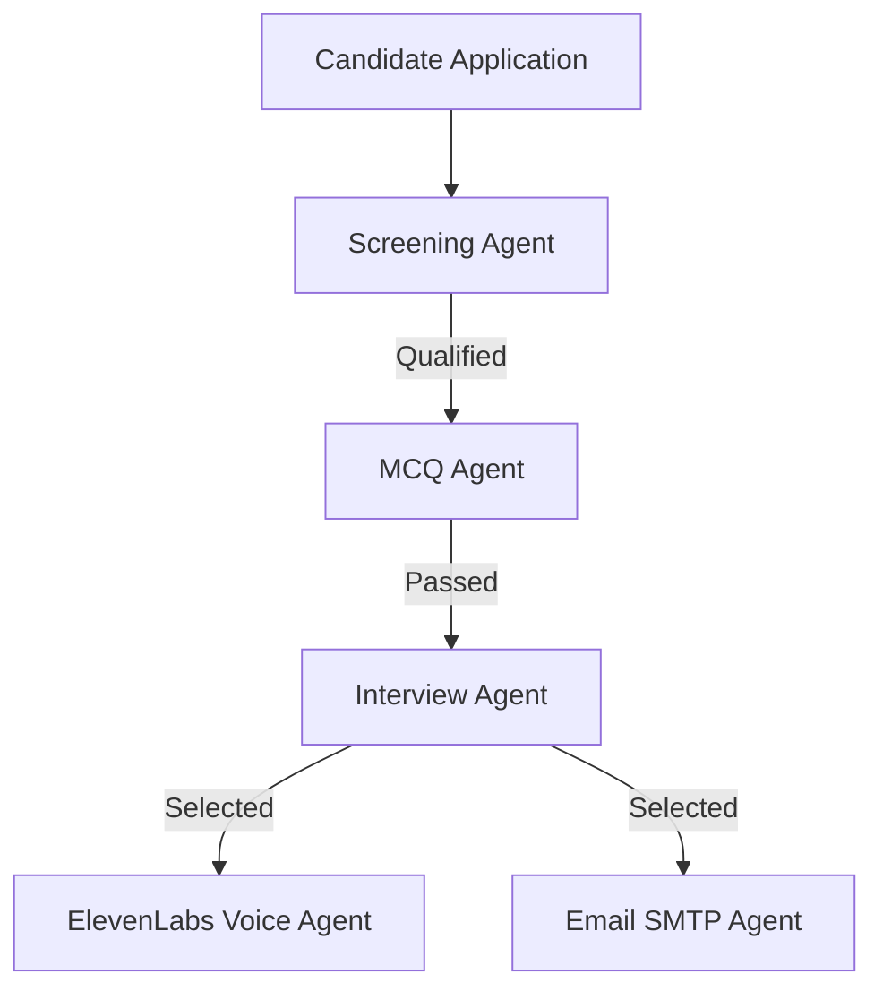

# AgentFlow Recruitment & Interview Platform 💼🚀

An advanced, AI-powered multi-agent recruiting and assessment platform. This application automates the candidate screening process, delivers customizable technical tests, conducts conversational voice/text technical interviews, and provides hiring managers with a comprehensive dashboard for evaluation.

---

## 🌟 Key Features

### 🧑 Candidate Assessment Pipeline
* **Resume Parsing & Screening**: Automatically extracts text from uploaded PDF resumes and screens candidates against job requirements.
* **Dynamic Technical MCQs**: Generates customized multiple-choice tests tailored to the candidate's skills and the job's difficulty rating.
* **Interactive Chat Interview**: A conversational AI interviewer asks technical and behavioral questions, with support for both typed text and voice recorded responses.
* **Automated Selection Notification**:
  * **Email**: Instantly dispatches confirmation emails with recruiter notes via SMTP.
  * **Voice Calls**: Triggers human-like voice confirmation calls directly to the candidate's phone using ElevenLabs.

### 🔒 Recruiter Admin Portal
* **Dynamic Job Board Management**: Create, edit, or delete job descriptions.
* **🪄 AI Job Description Assistant**: Powered by Gemini, recruiters can draft professional job descriptions by simply entering brief notes or required skills.
* **📈 Analytics & Leaderboard**: Automatically stack-ranks candidates based on their AI Match Score.
* **🎯 Fit & Skill Gap Card**: Displays matched skills, missing skills (from the JD), and identified resume red flags.
* **Detailed Interview Transcripts**: Review candidates' complete test details and hiring committee evaluations.

---

## 🤖 Multi-Agent Architecture

The application is powered by a network of specialized LLM agents located in `src/agents/`:



1. **Screening Agent (`src/agents/screening_agent/`)**:
   * Evaluates the candidate's resume against the Job Description.
   * Calculates a **0–100% Match Score** and parses matched skills, missing skills, and potential resume red flags.
2. **MCQ Agent (`src/agents/mcq_agent/`)**:
   * Dynamically constructs 5 multiple-choice questions matching the configured difficulty level of the target job.
3. **Interview Agent (`src/agents/interview_agent/`)**:
   * Conducts the interactive technical interview.
   * Evaluates the candidate's responses and transcripts, summarizing strengths for the Hiring Committee.
4. **ElevenLabs Voice Agent (`src/agents/elevenlabs_agent/`)**:
   * Initiates selection phone calls using natural voice synthesis.
5. **Email SMTP Agent (`src/agents/email_agent/`)**:
   * Sends formatted, professional assessment emails containing candidate summaries and application updates.

---

## ⚙️ Configuration & Setup

### 1. Prerequisites
* Python 3.10+
* Google Gemini API Key
* (Optional) ElevenLabs API Credentials & SMTP Credentials for Email/Voice calls

### 2. Installation
Clone this repository to your workspace, set up a virtual environment, and install dependencies:
```bash
# Set up virtual environment
python -m venv venv
venv\Scripts\activate

# Install dependencies
pip install -r requirements.txt
```

### 3. Environment variables
Create a `.env` file in the root directory and configure the following parameters:
```env
Gemini_API_Key="your_google_gemini_api_key"

# Email Configuration (SMTP)
SMTP_SERVER="smtp.gmail.com"
SMTP_PORT=587
SMTP_SENDER_EMAIL="your-email@gmail.com"
SMTP_SENDER_PASSWORD="your-app-password"

# ElevenLabs Configuration (Voice Calls)
ELEVENLABS_API_KEY="your_elevenlabs_api_key"
ELEVENLABS_AGENT_ID="your_elevenlabs_agent_id"
ELEVENLABS_PHONE_NUMBER_ID="your_elevenlabs_phone_number_id"
```

---

## 🚀 Running the Application

Start the Streamlit portal using:
```bash
streamlit run app.py
```

* **Candidate Portal**: Access the default views (`Open Positions` and `Candidate Assessment`) to apply and complete the technical tests.
* **Recruiter Portal**: Navigate to the `🔒 Recruiter Portal` tab and log in using the default credentials:
  * **Password**: `recruiter123`
